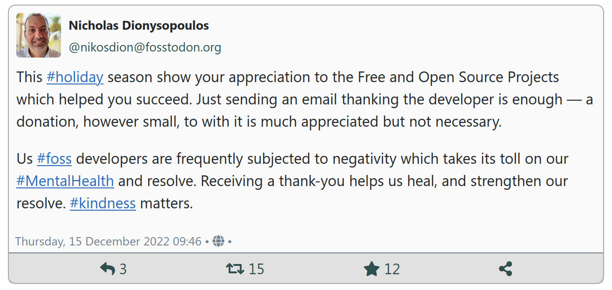

# Embed Mastodon toots in your site's content

Mastodon is a wonderful social network with a lot of meaningful and interesting conversation. When writing an article or blog post you may want to reference the source toot (Mastodon post) by embedding it in your content. However, Mastodon not having a centralised server it also lacks a way to embed toots in the way you can embed, for example, Twitter tweets or Facebook posts.

You can do that very easily with Fediverse Tools for Joomla.

First, make sure that the plugin “Content - Embed Toot” is enabled.

Then go to the Mastodon profile of the user on the web and click the date on the upper right hand side of the toot you want to embed. This opens a new page, e.g. `https://fosstodon.org/@nikosdion/109516579924736746`.

Go to your Joomla article and type `{toot YOUR_URL}` where YOUR_URL is the URL you copied above. For this example, it's `{toot https://fosstodon.org/@nikosdion/109516579924736746}`.

Save the article and view it in the frontend. It shows up like this:

## Caching and Performance

The toot content is cached —regardless of Joomla's caching settings— to ensure speedy loading of pages with embedded toots. You can fine-tune caching in the “Content - Embed Toot” plugin's options, [per the documentation](plg_content_fediverse.md)

## Presentation

The toots are read as JSON documents. They are formatted locally, on your own server, using the CSS provided with the plugin. There's even an automatic light and dark mode provision.

If you would like to override the way the toots are presented you should do a [standard Joomla media override](https://docs.joomla.org/Understanding_Output_Overrides#Media_Files_Override), i.e. copy the file `media/plg_content_fediverse/css/embedded.css` to `templates/YOUR_TEMPLATE/media/css/plg_content_fediverse/embedded.css` (or, if your template uses the new template structure available since Joomla 4.1, `media/templates/site/YOUR_TEMPLATE/css/plg_content_fediverse/embedded.css`). Make the changes to the latter file.

Please note that we provide the [SCSS / Sass](https://sass-lang.com/) source of the CSS in `media/plg_content_fediverse/css/embedded.scss`. We advise you to make changes to a copy of that SCSS file, compile it to CSS, and use that CSS in your template's media override directory.

## Privacy

Embedding toot, unlike embedding Facebook posts and Twitter tweets, does NOT use any third party JavaScript and does NOT expose your users' private information to the Mastodon instance. This means that you do not need to hide the embed behind a convoluted layer of JavaScript to obtain the user's consent to display a toot.

Kindly note that when a toot has an image or a video this is loaded directly from the Mastodon server. This only lets the Mastodon server see the IP address of your visitor. In most jurisdictions this is not a problem as an IP address is not personally identifiable information. In some jurisdictions, e.g. Germany, the IP address _might_ be considered personally identifiable information, e.g. if your site's visitor is currently logged into the same Mastodon server as the one you are displaying the toot from. If you are unsure about whether embedding toots may be illegal in your jurisdictions please ask a lawyer and keep in mind that **you** are solely responsible for legal compliance of your use of this software as per articles 15, 16, and 17 of [the software's license](../LICENSE). 
